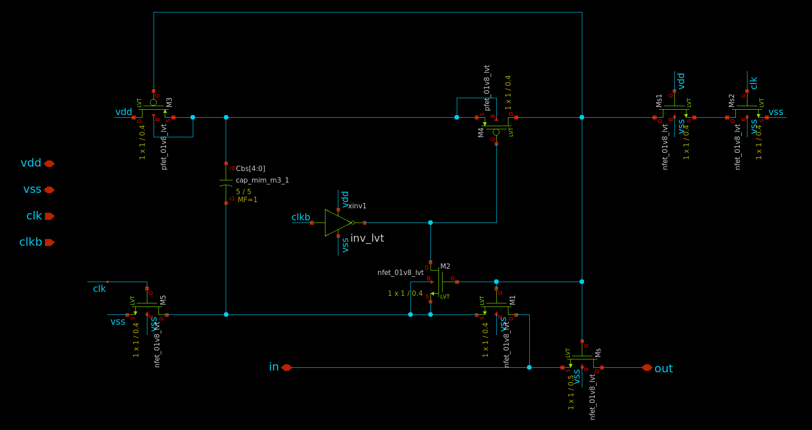

# 6bit sar adc

This project is the implementation of a 6bit sar adc using Skywater 130nm technology.
The purpose of this project is to test the open source tools provided with the PDK and to go through all the steps of the analog design flow.

## comparator
The schematic of the comparator was deisgned as follows :

The simulation result of the comparator test bench was deisgned as follows :

## sample-and-hold
The schematic of the sample-and-hold test bench was deisgned as follows :

The simulation result of the sample-and-hold test bench was deisgned as follows :

## cdac
The schematic of the cdac test bench was deisgned as follows :

## sar logic
The simulation result of the sar logic as follows :